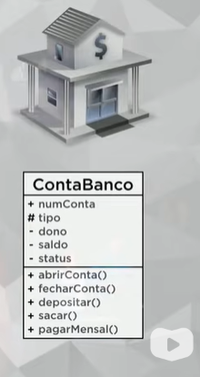
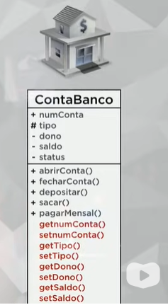

# Projeto banco criado no Curso em video

### Curso de POO em Java

Entendendo conceitos de:

- Classe
- Objeto
- Instancia
- Modificadores de visibilidade
- Métodos Especiais
  - Acessores (Getters)
  - Modificadores (Setters)
  - Construtores (Construct)

### UML da classe ContaBanco desenvolvida:

